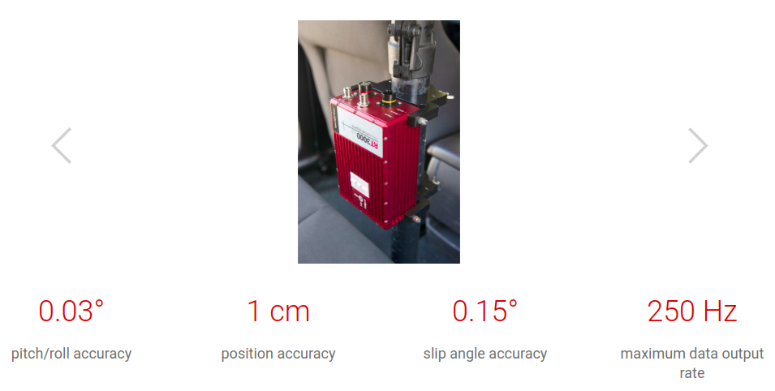

:orphan:

.. _rt3k:

RT3000 GPS2Cartesian
------------------------

This is how an RT3000 system is installed into a car   

RT3000 v3 is an industry standard GNSS/INS for ADAS and autonomous vehicle testing,  this module has jobs that are required for data transformations to generate reference data.

Note:

- GNSS stands for Global Navigation Satellite System
- INS stands for Inertial Navigation System

RT3000 v3 consists of

- rt3000-gps2cartesian-converter : It is a spark job that extracts raw rt3k sensor data like latitude,longitude and heading information from the antennas and converts it into cartersian coordinates.

RT3000 v3 uses the transverse mercator projection with the car position at start of logging as origin to have an accurate transformation. This start position is comparable with the accumulated odometry of the car.

